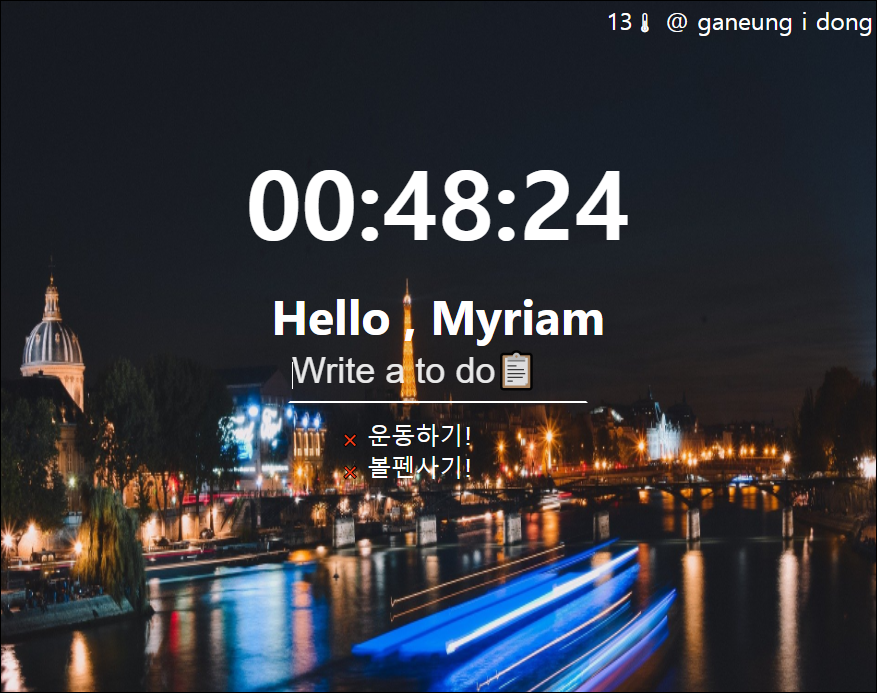

# Momentum 📝
구글 확장 프로그램 Momentum 클론

## Features (기능)

	 ✅ 현재시각

	 ✅ 할일 리스트

	 ✅ 지역,날씨
	
	 ✅ 무작위 배경화면

## 사용언어 / 도구

## 사용기술

	 ✅ fetch API
	 
	 ✅ OpenWeather API

	 ✅ localStorage

## Preview
  
		

# Try GitHub Pages 👁‍🗨

https://myriam-bora.github.io/Momentum/
